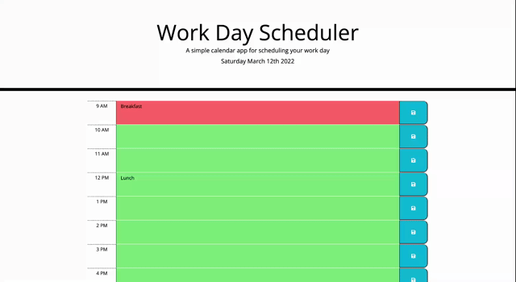

# Work Day Scheduler

 

## Description

A work day scheduler allows a user to save events for each hour of the day. The app will run in browser and feature dynamically updated HTML and CSS powered by jQuery. The app uses the Moment.js library to show current date and time.

## Table of Contents

- [Installation](#Installation)
- [Usage](#Usage)
- [DeployedLink](#DeployedLink)
- [License](#License)

- [Questions](#Questions)

## Installation

To install the necessary dependencies, run the following command: 
<code>Open index.html in browser.</code>

## Usage

## DeployedLink

https://king23wl.github.io/Work-Day-Scheduler/

## License

## Questions

For more information, please contact me:  

Email: xuanan.ian23y@gmail.com  
  GitHub: [King23WL](https://github.com/King23WL)
